Prerequisite
============

Php extension:

-   Soap

Installation
============

We can only guarantee that the modules work on magento version 1.7.0.0 to 1.9.\*. We can only guarantee that the module works with the standard checkout of Magento.

For general questions regarding installations please contact <support.solutions@payex.com> .

Step 1: Transferring the modules over to your FTP/SFTP location

Set your ftp/sftp client transfer type to binary.

First you need to unzip the modules from the original zip file to your computer, sometimes there are two layers of archived files, unzip them so you have the files looking like this on your computer:

Now transfer them over to the root of your magento site using FTP/SFTP, the root is usually the public\_html folder. The files will then migrate automatically to the appropriate location in your magento application. If the ftp-client complains of over written xml-files, it is nothing to worry about.

Step 2:

Sign in to magento as Administrator, <http://yoursite.com/admin> or <http://yoursite.com/index.php/admin>

Step 3:

Click the top right drop down menu called "system" and click "cache management".

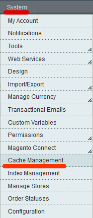

Then click the box for "configuration" and then submit to refresh.

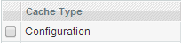

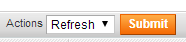

The installation is complete, now you need to configure the modules.

Activating getaddress module
----------------------------

Sign in as admin on your site and click system-&gt;configuration

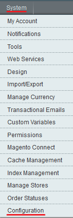

In the left menu find Social Security Number

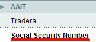

Insert the appropriate account number and encryption key.

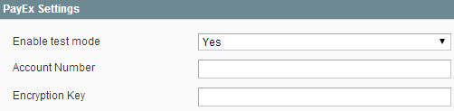

Set “Enable test mode” to no if you want it in live/production mode.

Configuration
=============

Sign in to magento as Administrator, <http://yoursite.com/admin> or <http://yoursite.com/index.php/admin>

To configure the modules go to the "system" menu and click "configuration" in the bottom. This expands a margin on the left hand side.

On the left hand side in the margin find under "Sales" where it says "payment methods" and click it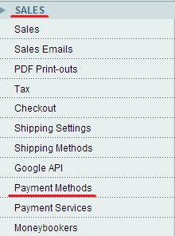

Here you can configure the different modules:

PayEx Payments

PayEx Factoring

[PayEx Bank Debit](#_Payex_Bank_Debit)

PayEx Manual Autopay Payments

[PayEx Invoice Payments](#_PayEx_Invoice_Payments)

Payex Payments
--------------------------------------------------------------------------------------------------------------

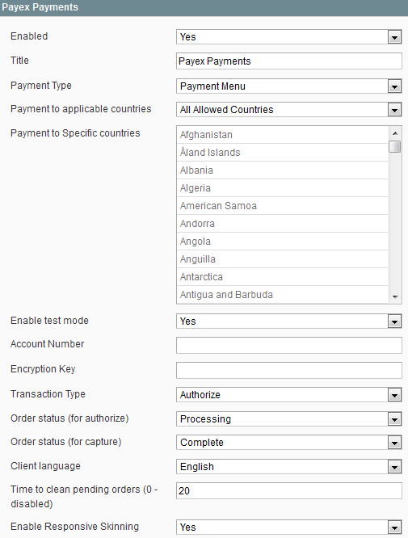

Enabled: Yes if enabled, no if disabled

Title: Name of the module

Payment type: Which type of payment model you would like to use

Payment to applicable countries: Payment differences in different countries

Payment to Specific countries: Change the countries to the specific payment model

Enable test mode: Set “Yes” if you are testing (if you are testing remember to use PayEx testaccount)

Account Number: You can collect the account number in Payex Merchant Admin; for production mode: <https://secure.payex.com/Admin/Logon.aspx> and for test mode: <http://test-secure.payex.com/Admin/Logon.aspx> Remember there are different account numbers for test and production mode. For more info contact PayEx support.solutions@payex.com

**Encryption Key**: The encryption key you get in Payex Merchant Admin (Choose md5). Remember there are different encryption keys for test and production mode For more information contact PayEx support <support.solutions@payex.com>.

To generate an encryption key

Step 1:

you must go to <http://www.payexpim.com/> and choose admin for either test or production environment. 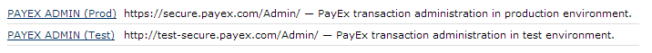

Step 2:

Sign in with the information you have been given by payex

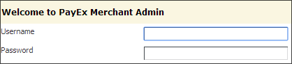

Step 3: In the margin on the left, find “Merchant” and click on “Merchant profile”

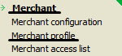

Step 4:

Click on “new encryption key”

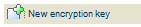

And save when you’ve written down the key

Complete

Transaction Type: Authorize is the standard transaction type, it requires a capture of the order. With Sale the amount ordered is processed immediately and withdrawn from the customers card. For more info contact PayEx support support.solutions@payex.com

Order status (for authorize): The status the order should have when amount has been reserved from customer but not yet captured

Order status (for capture): Status after order has been captured

Client language: Language displayed to customer

Time to clean pending orders (0 - disabled): After this time the order will be canceled if user have not payed before that

Enable Responsive Skinning: enables the module to be used on smart phones.

Don’t forget to activate [transaction callback](#section) in PayEx Merchant Admin

Payex Factoring and part payment
---------------------------------------------------------------------------------------------------------------------------------

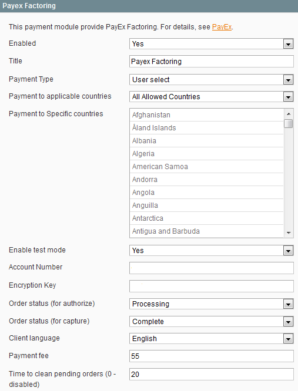

Enabled: Yes if enabled, no if disabled

Title: Name of the module

Payment type: You can choose between factoring, part payment or user select. On user select the customer will choose either factoring or part payment in the checkout.

Payment to applicable countries: Payment differences in different countries

Payment to Specific countries: Change the countries to the specific payment model

Enable test mode: Set “Yes” if you are testing (if you are testing remember to use PayEx testaccount)

Account number: You can collect the account number in Payex Merchant Admin; for production mode: <https://secure.payex.com/Admin/Logon.aspx> and for test mode: <http://test-secure.payex.com/Admin/Logon.aspx> Remember there are different account numbers for test and production mode. For more info contact PayEx support.solutions@payex.com

Encryption Key: The encryption key you get in Payex Merchant Admin (Choose md5). Remember there are different encryption keys for test and production mode For more information contact PayEx support <support.solutions@payex.com>.

To learn how to generate an encryption key look [here](#encryptionkey)

Order status(for authorize): The status the order should have when amount has been reserved from customer but not yet captured

Order status(for capture): Status after order has been captured

Client language: Language displayed to customer

Payment fee: How much the invoice fee is

Time to clean pending orders(0-disabled): After this time the order will be canceled if user have not payed before that

Don’t forget to activate [transaction callback](#section) in PayEx Merchant Admin

Payex Bank Debit
------------------------------------------------------------------------------------------------------------------

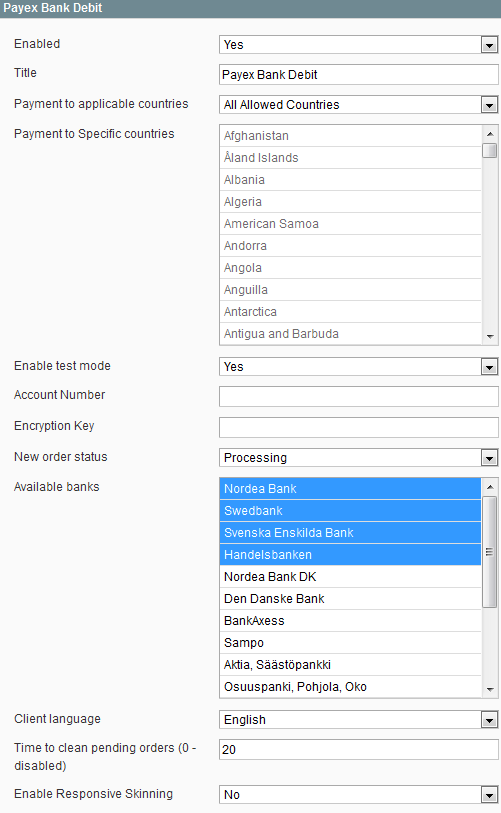

Enabled: Yes if enabled, no if disabled

Title: Name of the module

Payment to applicable countries: Payment differences in different countries

Payment to Specific countries: Change the countries to the specific payment model

Enable test mode: Set “Yes” if you are testing (if you are testing remember to use PayEx testaccount)

Account number: You can collect the account number in Payex Merchant Admin; for production mode: <https://secure.payex.com/Admin/Logon.aspx> and for test mode: <http://test-secure.payex.com/Admin/Logon.aspx> Remember there are different account numbers for test and production mode. For more info contact PayEx support.solutions@payex.com

Encryption Key: The encryption key you get in Payex Merchant Admin (Choose md5). Remember there are different encryption keys for test and production mode For more information contact PayEx support <support.solutions@payex.com>.

To learn how to generate an encryption key look [here](#encryptionkey)

New order status: Change the status on a newly placed order

Available banks: Which banks are allowed to be used

Time to clean pending orders(0-disabled): After this time the order will be canceled if user have not payed before that

Client language: Language displayed to customer

Don’t forget to activate [transaction callback](#section) in PayEx Merchant Admin

PayEx Manual Autopay Payments
-----------------------------------------------------------------------------------------------------------------------------------

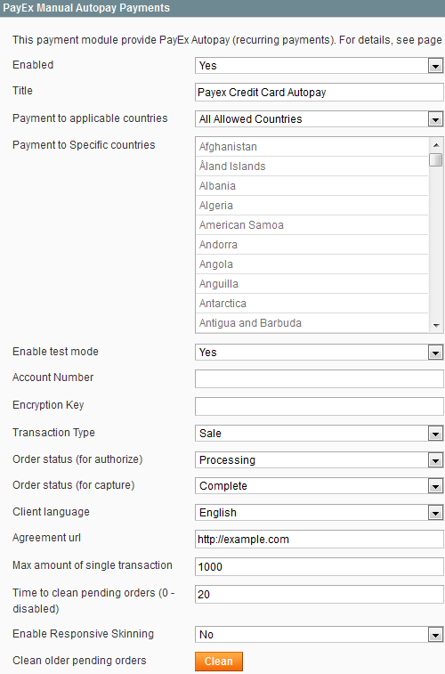

Enabled: Yes if enabled, no if disabled

Title: Name of the module

Payment to applicable countries: Payment differences in different countries

Payment to Specific countries: Change the countries to the specific payment model

Enable test mode: Set “Yes” if you are testing (if you are testing remember to use PayEx testaccount)

Account number: You can collect the account number in Payex Merchant Admin; for production mode: <https://secure.payex.com/Admin/Logon.aspx> and for test mode: <http://test-secure.payex.com/Admin/Logon.aspx> Remember there are different account numbers for test and production mode. For more info contact PayEx support.solutions@payex.com

Encryption Key: The encryption key you get in Payex Merchant Admin (Choose md5). Remember there are different encryption keys for test and production mode For more information contact PayEx support <support.solutions@payex.com>.

To learn how to generate an encryption key look [here](#encryptionkey)

Transaction Type: Authorize is the standard transaction type, it requires a capture of the order. With Sale the amount ordered is processed immediately and withdrawn from the customers card. For more info contact PayEx support support.solutions@payex.com

Order status (for authorize): The status the order should have when amount has been reserved from customer but not yet captured

Order status (for capture): Status after order has been captured

Client language: Language displayed to customer

Agreement url: URL link to payment agreement

Max amount of single transaction: the highest amount of money one can pay per single transaction

Time to clean pending orders(0-disabled): After this time the order will be canceled if user have not payed before that

Enable Responsive skinning: enables the module to be used on smart phones

Clean older pending orders: clear all the old pending orders

Don’t forget to activate [transaction callback](#section) in PayEx Merchant Admin

PayEx Invoice Payments
------------------------------------------------------------------------------------------------------------------------------

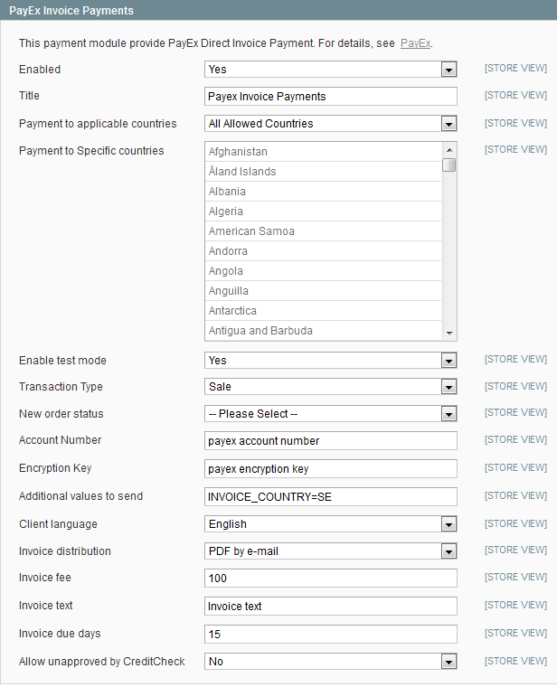

Enabled: Yes if enabled, no if disabled

Title: Name of the module

Payment to applicable countries: Payment differences in different countries

Payment to Specific countries: Change the countries to the specific payment model

Enable test mode: Set “Yes” if you are testing (if you are testing remember to use PayEx testaccount)

Transaction Type: Authorize is the standard transaction type, it requires a capture of the order. With Sale the amount ordered is processed immediately and withdrawn from the customers card. For more info contact PayEx support support.solutions@payex.com

New order status: Change the status on a newly placed order

Account number: You can collect the account number in Payex Merchant Admin; for production mode: <https://secure.payex.com/Admin/Logon.aspx> and for test mode: <http://test-secure.payex.com/Admin/Logon.aspx> Remember there are different account numbers for test and production mode. For more info contact PayEx support.solutions@payex.com

Encryption Key: The encryption key you get in Payex Merchant Admin (Choose md5). Remember there are different encryption keys for test and production mode For more information contact PayEx support <support.solutions@payex.com>.

To learn how to generate an encryption key look [here](#encryptionkey)

Additional values to send: enter any additional values you wish to send

Client language: Language displayed to customer

Invoice distribution: pdf by email or mail

Invoice fee: self-explanatory

Invoice text: include a text in the invoice

Invoice due days: self-explanatory

Allow unapproved by CreditCheck: yes or no

Don’t forget to activate [transaction callback](#section) in PayEx Merchant Admin

How to activate Transaction Callback
------------------------------------

Transaction callback is an extra process used by PayEx to verify that the webshop is informed of the result of the payment processing. It is useful if your server goes down during payment or if customer close the webbrowser or lose connection just after payment. Callback is a required functionality.

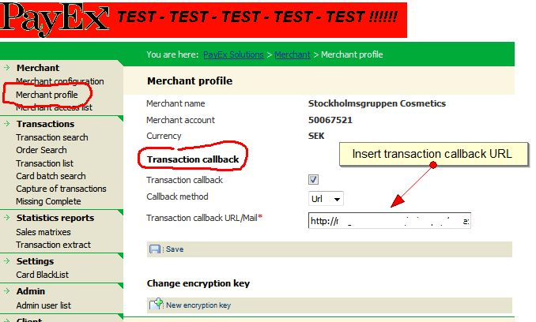

Use the following URL

<http://shop.com/index.php/payexapi/payexapi/transactions>

Change shop.com for your shop's url

How to translate the modules
----------------------------

Log in to your site using ftp/sftp and go to /app/locale/en\_US/ The app folder should be in the root of your site(that’s usually public\_html).

In the en\_US folder you should find the modules csv files called: AAIT\_Bankdebit.csv, AAIT\_Payex2.csv, AAIT\_Payexautopay.csv and AAIT\_Payexinvoice.csv

Now translate the corresponding sentences/words that are within the “ ”

example: "The customer was redirected to PayEx.","The customer was redirected to PayEx.*"*

Translated(Swedish) version: "The customer was redirected to PayEx.","Kunden skickades till PayEx."
